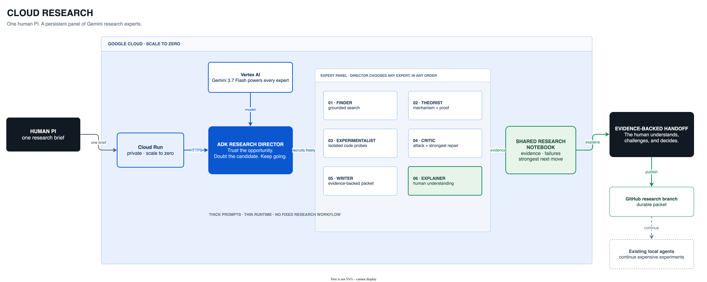

# Cloud Research

> Every researcher becomes the PI of a persistent team of AI experts.

Cloud Research is a model-directed research lab built for the **Taskmaster** track of the All
Things Agentic Hackathon. One brief recruits six Gemini experts that search, theorize, experiment,
challenge, write, and explain while the human works on something else.

It is not an automated-paper claim and it is not another literature summarizer. It is a research
continuity system: the human sets the program; the lab preserves momentum and returns an
evidence-backed handoff the human can understand, challenge, and continue.

## The product idea

Human attention is serial. Research is not. The interesting move is not to remove the scientist—it
is to turn the scientist into a PI with a persistent expert panel.

The runtime therefore has no scripted scientific workflow. The Director sees the brief and calls
Finder, Theorist, Experimentalist, Critic, Writer, or Explainer in whatever order the evidence
demands. The prompts carry the research taste; the code stays thin.



```text
Human PI
   │ one research brief
   ▼
Cloud Run ── Google ADK Research Director
                  │ chooses freely
        ┌─────────┼─────────┬─────────┬─────────┬─────────┐
        ▼         ▼         ▼         ▼         ▼         ▼
     Finder   Theorist  Experiment  Critic    Writer  Explainer
        │         │     (Gemini      │          │         │
        └─────────┴──── code exec) ──┴──────────┴─────────┘
                              │
                    evidence-backed handoff
                         + GitHub packet
```

## Google stack

- **Gemini 3.7 Flash** — reasoning, grounded search, specialist collaboration, and isolated code probes.
- **Google Agent Development Kit 2.7.1** — one Director and six expert `AgentTool`s.
- **Google Cloud Run** — the HTTPS service accepts the brief; a Cloud Run Job keeps the ADK run
  alive after the browser closes, then exits and scales back to zero.

## Prompt philosophy

- **Concise:** each expert gets a few lines, not a policy manual.
- **Excited:** pursue the crack that changes understanding; truth should feel interesting.
- **Certain:** valuable research fruit exists, even when the current candidate is wrong.

The shared idea is: **Trust the opportunity. Doubt the candidate. Keep going.**

## Run locally without calling Gemini

The static app, imports, and tests do not call any model:

```bash
uv sync
uv run pytest
uv run uvicorn app.fast_api_app:app --reload
```

Open <http://localhost:8000>. Submitting a brief does call Gemini, so leave the form untouched for
offline UI verification.

For local live use, copy `.env.example` to `.env` and use either Vertex application-default
credentials or a Google AI Studio key. Never commit a key.

## Deploy

See [`docs/GOOGLE_CLOUD.md`](docs/GOOGLE_CLOUD.md). The deployment is private and constrained to
zero minimum / one maximum Cloud Run instance by default so the free-trial credit remains under
control.

## Verified live

See [`docs/SMOKE_TESTS.md`](docs/SMOKE_TESTS.md) for the real private-service and Cloud Run Job
tests, their outputs, and the two defects those tests exposed and fixed.

## Where the existing system went

See [`docs/MODULE_MAP.md`](docs/MODULE_MAP.md). Only scientific taste and small pure helpers were
ported. The existing system was not edited, imported, started, or given to the Cloud Run container.
